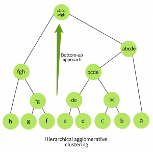
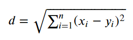
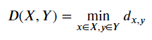

# Agglomerative Clustering

## Conceito:

Este algoritmo é o tipo mais utilizado de clusterização hierárquica para agrupar objetos em clusters baseados em suas similaridades. Ele inicia tratando cada objeto como um único cluster. Em seguida, os pares de clusters são sucessivamente mesclados até que todos os clusters estejam mesclados num grande cluster contendo todos os objetos. O resultado é uma representação baseado em árvore dos objetos, como observado na imagem abaixo.

## Classes de Problemas com Melhores Resultados:

O algoritmo obterá melhores resultadose em problemas cujo objetivo seja encontrar relações e semelhanças entre os dados, sem a necessidade de se conhecer previamente em detalhes os dados.

## Definição Teórica e Modelagem Matemática:

O Agglomerative Clustering essencialmente começa a partir de um cluster individual, em seguida são calculadas as distâncias entre eles. Aqueles clusters com as menores distâncias entre si serão mesclados, criando um nó. Esse processo será repetido até sobrar apenas um cluster.

A medida mais comum de distância utilizada é a distância Euclidiana, exposta abaixo:

Para definir a partir de qual posição será calculada a distância em cada cluster, temos que estabelecer uma regra. Esta regra é bem simples e é definida com a distância mínima entre dois pontos dos clusters. Ela pode ser descrita matematicamente da seguinte forma:

Onde a distância entre o cluster X e o cluster Y é definido pela distância mínima entre x e y, os quais pertencem aos clusters X e Y respectivamente.

## Vantagens:

- Implementação simples;
- Pode produzir uma oredenação de objetos, o que pode ser informativo;
- Não é necessário pré-escpecificar um número de clusters;
- Pequenos clusters são criados, o que pode levar a descobertas de similaridades entre os dados.

## Desvantagens (limitações):

- Fornece o melhor resultado em alguns casos apenas;
- O algoritmo nunca desgaz o que foi feito previamente, o que significa que os objetos podem ter sidos agrupados incorretamente;
- O uso de várias métricas de distância entre os clusters pode produzir resultados distintos.

## Exemplo de uma Aplicação em Python:

Presente no arquivo agglomerativeClustering.ipynb

## Referências:

- https://www.datanovia.com/en/lessons/agglomerative-hierarchical-clustering/
- https://www.geeksforgeeks.org/ml-hierarchical-clustering-agglomerative-and-divisive-clustering/
- https://towardsdatascience.com/breaking-down-the-agglomerative-clustering-process-1c367f74c7c2
- https://dataaspirant.com/hierarchical-clustering-algorithm/
- https://www.geeksforgeeks.org/implementing-agglomerative-clustering-using-sklearn/
