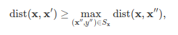
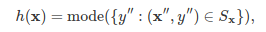
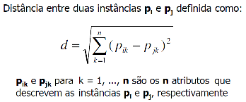

# K-Nearest-Neighbors

## Conceito:

O método k-NN de classificação tem como objetivo
classificar uma amostra desconhecida de dados a partir das
classificações conhecidas dos seus vizinhos. Considerando que
a distância entre a amostra desconhecida e os vizinhos possa ser
calculada, aquela com o menor valor corresponde ao vizinho
mais próximo e semelhante à amostra. Dessa forma, a
classificação da amostra desconhecida pode ser baseada neste
vizinho mais próximo. O número k de vizinhos considerados pode variar como mostrado abaixo.

## Classes de Problemas com Melhores Resultados:

É um método indicado para seleção e classificação de amostras desconhecidas, as quais são semelhantes aos dados de entrada.

## Definição Teórica e Modelagem Matemática:

O algoritmo k-NN pode ser definido com os seguintes passos:

- Seleção no número k de vizinhos;
- Cálculo da distância Euclidiana entre os k vizinhos;
- Pegar os k vizinhos mais próximos e a distância Euclidiana calculada;
- Entre esses vizinhos, conte o número de pontos em cada categoria;
- Associe os novos pontos para aquela categoria cujo número de vizinhos é máximo;
- Agora o seu modelo está pronto.

A definição formal do k-NN é a seguinte:

- Ponto de teste: **x**;
- _Sx_ denota o conjunto _k_ de vizinhos de **x**. Formalmente _Sx_ é definido como _Sx ⊆ D e ∀(x′,y′) ∈ D\Sx_,

Para cada ponto em _D_, mas não em _Sx_ que está distante igualmente de **x** e do ponto mais distante de _Sx_. Podemos definir o classificador _h()_ como uma função que retorna a categoria mais comum em _Sx_:

em que _mode(-)_ indica a categoria de maior ocorrência no conjunto.

A fórmula da distância mais bem utilizada é a Euclidiana:

## Vantagens:

- Fácil compreensão e implementação simples
- Pode ser utilizado tanto para problemas de classificação e regressão
- Ideal para dados não lineares
- Pode lidar naturalmente com casos de multi-categorias
- Possui um bom desempenho com dados representativos

## Desvantagens (limitações):

- Alto custo computacional, já que armazena toda a base de treinamento
- Alto armazenamento na memória
- A predição é reduzida se o valor de N for alto
- Sensível a características irrelevantes

## Exemplo de uma Aplicação em Python:

Presente no arquivo kNN.ipynb

## Referências:

- https://www.cs.cornell.edu/courses/cs4780/2018fa/lectures/lecturenote02_kNN.html
- https://www.javatpoint.com/k-nearest-neighbor-algorithm-for-machine-learning
- https://learn.g2.com/k-nearest-neighbor
- https://medium.com/brasil-ai/knn-k-nearest-neighbors-1-e140c82e9c4e
- https://www.youtube.com/watch?v=CQveSaMyEwM&t
