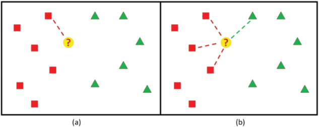

# K-Nearest-Neighbors

## Conceito:

O método k-NN de classificação tem como objetivo
classificar uma amostra desconhecida de dados a partir das
classificações conhecidas dos seus vizinhos. Considerando que
a distância entre a amostra desconhecida e os vizinhos possa ser
calculada, aquela com o menor valor corresponde ao vizinho
mais próximo e semelhante à amostra. Dessa forma, a
classificação da amostra desconhecida pode ser baseada neste
vizinho mais próximo. O número k de vizinhos considerados pode variar como mostrado abaixo.

## Classes de Problemas com Melhores Resultados:

É um método indicado para seleção e classificação de amostras desconhecidas, as quais são semelhantes aos dados de entrada.

## Definição Teórica e Modelagem Matemática:

## Vantagens:

## Desvantagens (limitações):

## Exemplo de uma Aplicação em Python:
