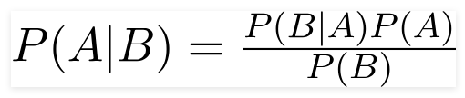

# Naive Bayes Classifiers

## Conceito:

Um classificador Naive Bayes é um simples classificador probabilístico baseado na aplicação do teorema de Bayes com fortes suposições independentes.

Em termos simples, o classificador Naive Bayes assume que a presença ou ausência de uma característica particular de uma classe não está relacionada com a presença ou ausência de qualquer outra característica. Por exemplo, uma fruta pode ser considerada uma maçã se for vermelha, arredondada e em torno de 10 cm de diâmetro. Mesmo que essas características dependam uma da outra, o classificador Naive Bayes considera que todas essas propriedades contribuem de modo independente para que essa fruta seja uma maçã.

## Classes de Problemas com Melhores Resultados:

O modelo Naive Bayes é útil para problemas com grandes bases de dados e/ou aqueles que não tem muitas variáveis dependentes entre si.

Além disso, os algoritmos Naive Bayes são utilizados em predições em tempo real e de multi classes. Suas simples implementações também os tornam úteis na classificação de textos, análise de sentimentos e filtro de spam.

## Definição Teórica e Modelagem Matemática:

O teorema de Bayes encontra a probabilidade de um evento ocorrer dada a probabilidade de outro evento que já ocorreu. Matematicamente é descrito por:

onde A e B são eventos e P(B) ≠ 0.

- Basicamente, estamos tentando encontrar a probabilidade do evento A dado que o evento B ocorreu. O evento B é também denominado como "evidência".
- P(A) é a probabilidade a priori de A, ou seja, a probabilidade do evento antes dele ocorrer. A evidência é um valor de uma instância desconhecida, no caso o evento B.
- P(A | B) é a probabilidade a posteriori de B, ou seja, a probabilidade do evento ocorrer depois da evidência ser vista.

Agora, colocaremos a suposição de simplicidade ao teorema de Bayes, que é a independência entre os fatores. Dessa forma, dividimos a evidência em duas partes independentes.

Se dois eventos A e B são independentes, então,

P(A,B) = P(A)P(B)

Considerando duas classes y e x, temos o seguinte resultado:

Considerando o denominador constante para determinado input, podemos removê-lo este termo e expressá-lo da seguinte forma:

Agora, teremos a criação do modelo de classificação. Para isso, encontramos a probabilidade de um conjunto de entradas para todos os valores possíveis da variável y e retorna a saída com a probabilidade máxima, o que pode ser expressado matematicamente como:

Finalmente temos o cálculo de P(y) e P(xi|y). P(y) pode ser chamada de probabilidade de classes e P(xi|y) é chamado de probabilidade condicional.

## Vantagens:

- É fácil e rápido para realizar predições das classes do dataset.
- Possui um bom desempenho na predição de multi classes
- Quando há a suposição de independência entre os fatores, o classificador Naive Bayes tem um desempenho melhor quando comparado a outros modelos, além de precisar de menos dados para treinamento.

## Desvantagens (limitações):

- Se uma variável possui uma categoria que não foi observada no dataset de treinamento, o modelo atribuirá uma probabilidade 0 e não conseguirá realizar a predição.
- Na vida real, é quase impossível conseguir um conjunto de preditores que são completamente independentes.

## Exemplo de uma Aplicação em Python:

Presente no arquivo NaiveBayes.ipynb

## Referências:

- https://www.ic.unicamp.br/~rocha/teaching/2011s2/mc906/aulas/naive-bayes-classifier.pdf
- https://www.analyticsvidhya.com/blog/2017/09/naive-bayes-explained/
- https://www.geeksforgeeks.org/naive-bayes-classifiers/
- https://www.analyticsvidhya.com/blog/2017/09/naive-bayes-explained/
